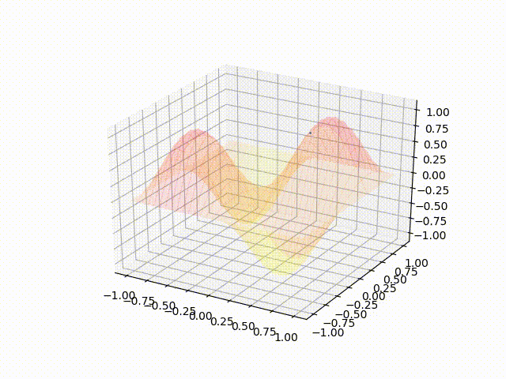
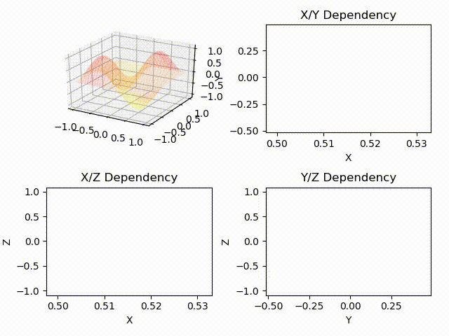
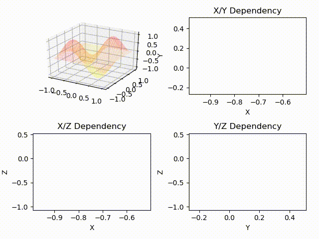
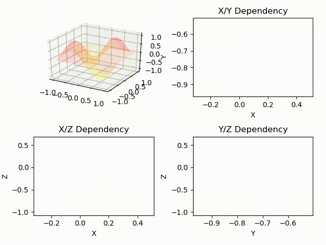
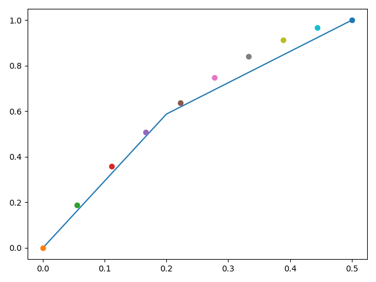
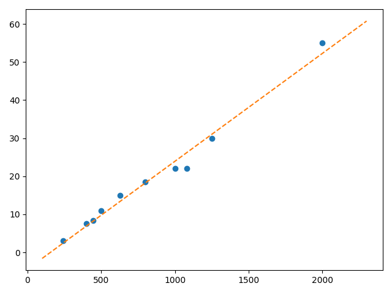
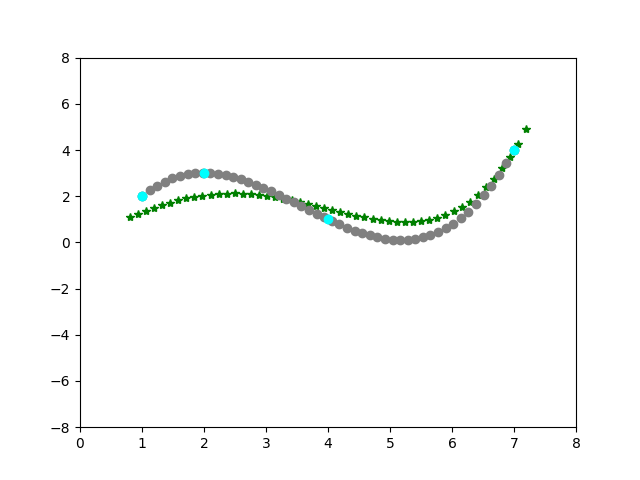

# DataAnalisys
#### Collection of self implemented methods of mathematical optimizations, deep neural networks

### Random Search algorithm video animation

### Gradient Descent algorithm video animations
##### Starting point Xo = 0.5, Yo = 0.45

##### Starting point Xo = -0.75, Yo = -0.25

##### Starting point Xo = -0.3, Yo = -0.7

### Interpolations using poly numbers
##### Xs = np.array([1, 2, 4, 7])
##### Ys = np.array([2, 3, 1, 4])

### Linear Approximation Analytical
##### Xs = [240, 400, 445, 500, 630, 800, 1000, 1080, 1250, 2000]
##### Ys = [3, 7.5, 8.37, 11, 15, 18.5, 22, 22, 30, 55]

### Linear Approximation Regression
##### Xs = [1, 2, 4, 7]
##### Ys = [2, 3, 1, 4]

Animation                  |  Result
:-------------------------:|:-------------------------:
  |  

