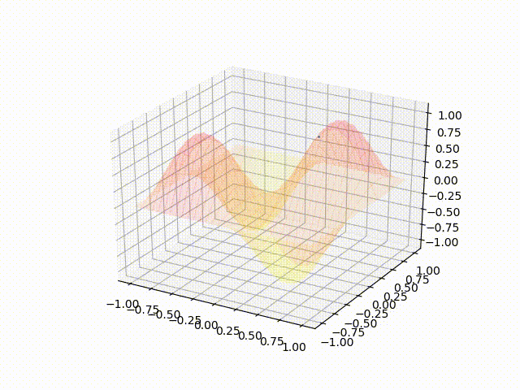
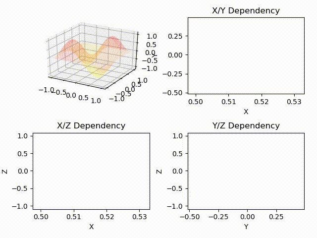
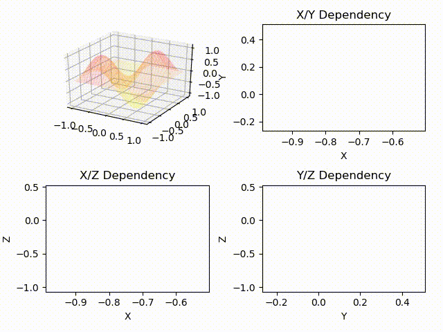
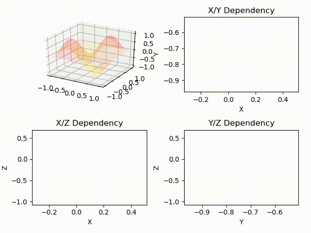

# DataAnalisys
Collection of self implemented methods of mathematical optimizations, deep neural networks

### Random Search algorithm video animation

### Gradient Descent algorithm video animations

