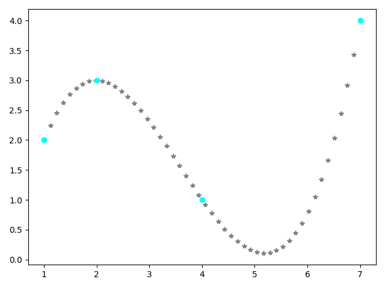

# DataAnalisys
####Collection of self implemented methods of mathematical optimizations, deep neural networks

### Random Search algorithm video animation

### Gradient Descent algorithm video animations
##### Starting point x0 = 0.5, y0 = 0.45

##### Starting point x0 = -0.75, y0 = -0.25

##### Starting point x0 = -0.3, y0 = -0.7

### Interpolations using poly numbers

### Approximation Linear
##### Xs = [240, 400, 445, 500, 630, 800, 1000, 1080, 1250, 2000]
##### Ys = [3, 7.5, 8.37, 11, 15, 18.5, 22, 22, 30, 55]
